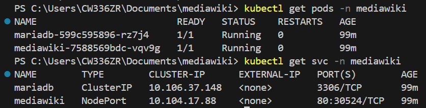
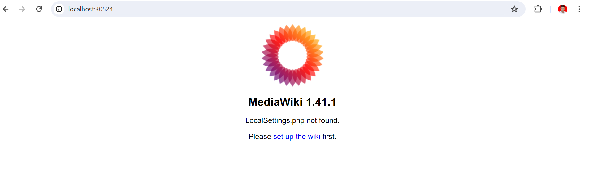
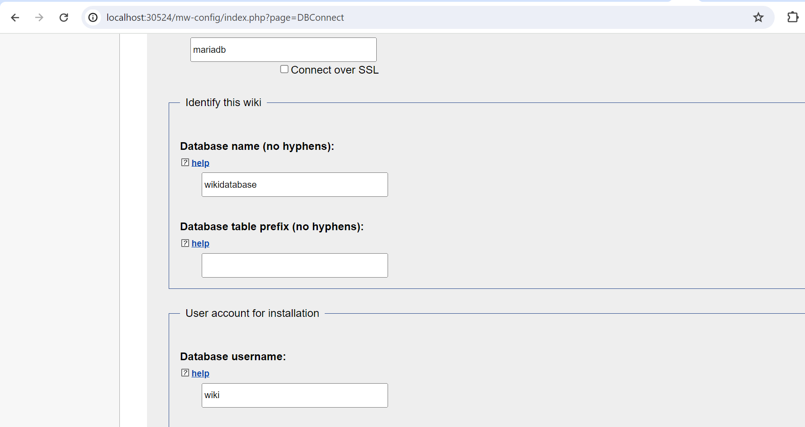
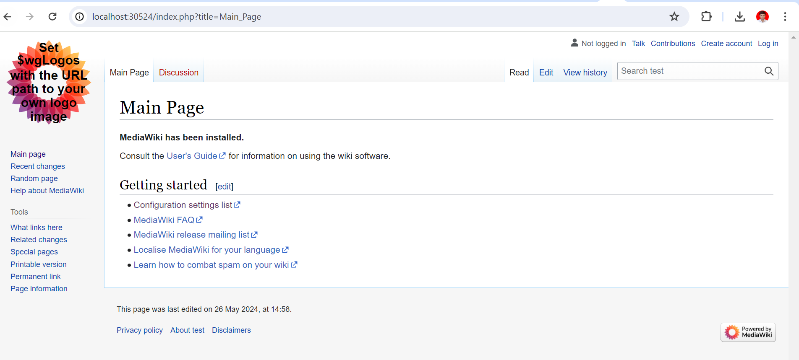

# Mediawiki
Contains Docker, kubernetes files and helm chart for setting up the Mediawiki v1.41 on Kubernetes cluster

## Docker
- /Dockerfile - This Dockerfile is used to create a Docker image for running MediaWiki. The image is based on Red Hat Enterprise Linux (RHEL) 8 and includes all the necessary dependencies for running MediaWiki.
- For Mediawiki database we are using `mariadb:latest` image.

## Deploy using helm chart
This Helm chart is designed to simplify the deployment of MediaWiki on Kubernetes clusters.

### Chart Content:

```
mediawiki-helm/
├── files/
│   ├── create-user.sql
│   └── LocalSettings.php
├── templates/
│   ├── mariadb/
│   │   ├── deployment.yaml
│   │   ├── pvc.yaml
│   │   ├── secret-password.yaml
│   │   ├── secret.yaml
│   │   └── service.yaml
│   ├── mediawiki/
│   │   ├── deployment.yaml
│   │   ├── configmap.yaml
│   │   ├── hpa.yaml
│   │   └── service.yaml
│   ├── NOTES.txt
│   └── _helpers.tpl
├── .helmignore
├── Chart.yaml
└── values.yaml
```

### Chart Details:
This chart will do the following:
- Deploy Mediawiki as a Kubernetes Deployment.
- Optionally create a Persistent Volume Claim if persistent storage is needed.
- Create a Kubernetes Service to expose mediawiki to other services within the cluster or externally.
- Configure and create secrets, configmaps, environment variables, resource limits, and requests for mediawiki.


### Installing the chart

```
helm install mediawiki mediawiki-helm/ -n 'namespace'
```
This command deploys MediaWiki on the Kubernetes cluster using the default configuration. You can find the default values in the `values.yaml` file and override them during installation if necessary.

### Uninstalling the Chart
```
helm uninstall mediawiki -n 'namespace'
```
### Enable hpa for Horizontal pod autocaling
```
helm upgrade --install mediawiki mediawiki-helm/ -n 'namespace' --set mediawiki.autocaling.enabled=true
```
### Enable pvc for mariadb database
```
helm install mediawiki mediawiki-helm/ -n 'namespace' --set mariadb.pvc.enabled=true
```

### Load LocalSettings.php file after configuring mediawiki
We can load LocalSettings.php file inside the deployment once the configuration of mediawiki is done by keeping the new LocalSettings.php insde the `mediawiki-helm/files/` directory and upgrading the helm using:
```
helm upgrade mediawiki mediawiki-helm/ -n 'namespace' --set mediawiki.localsettings.enabled=true
```
Note: The flag should be set as false for the initial deployment.


### Configuration

The following table lists some of the configurable parameters of the MediaWiki chart and their default values. For a full list, see the values.yaml file.

| Parameter | Description | Default |
| --------- | ----------- | ------- |
| `mediawiki.image.repository` | image repository for mediawiki | mediawiki |
| `mediawiki.image.pullPolicy` | image pull policy | IfNotPresent |
| `mediawiki.image.tag` | image tag | v1 |
| `mediawiki.service.type` | kubernetes service type | NodePort |
| `mediawiki.service.port` | service HTTP port | 80 |
| `mediawiki.resources` | CPU/Memory resource requests/limits  | {} |
| `mediawiki.localsettings.enabled` | mounting LocalSettings.php | false |
| `mediawiki.autoscaling.enabled` | HPA for the mediawiki pod  | false |
| `mariadb.image.repository` | image repository for mariadb database | mariadb |
| `mariadb.image.pullPolicy` | image pull policy | IfNotPresent |
| `mariadb.image.tag` | image tag | latest |
| `mariadb.dbUsers.database` | database to be used by mediawiki  | wikidatabase |
| `mariadb.dbUsers.username` | mariadb user | wiki |
| `mariadb.dbUsers.password` | password for mardiadb user | password |
| `mariadb.service.type` | kubernetes service type | ClusterIP |
| `mariadb.service.port` | service HTTP port | 3306 |
| `mariadb.resources` | CPU/Memory resource requests/limits  | {} |
| `mariadb.pvc.enabled` | Enabling pvc to prevent database | false |
| `mariadb.pvc.accesModes` | accesmode for the PVC | ReadWriteOnce |

### Configure mediawiki using the following db creds:
- DB host: `mariadb`
- DB username: `wiki`
- DB database: `wikidatabase`
- DB password: `password`

## Output Screenshot
<br />

<br />

<br />


## Deployment Strategy
Rolling updates are the default strategy for deployments in Kubernetes. This process allows you to update your application in Kubernetes with minimal downtime, as it ensures that some instances of your application are always running during the update process.


## Deploy using K8s-manifests
The kubernetes objects are defined in `K8s-manifests` folder.
### K8s-manifests/mariadb 
This directory contains the necessary Kubernetes manifest files to deploy a MariaDB database, which is a prerequisite for running MediaWiki.

It consists of:

- db-deployment.yaml
- db-service.yaml 
- pvc.yaml
- secret-password.yaml - for storing `base64` converted password string to be used for variable `MARIADB_ROOT_PASSWORD`.
- secret.yaml - for storing `base64` converted db init script for creating an user and database.

#### Deploy
```
kubectl apply -f k8s-manifests/mariadb/ -n "namespace"
```
### K8s-manifests/mediaWiki
This directory contains the necessary Kubernetes manifest files to deploy a mediawiki and an example LocalSettings.php which can be mounted using ConfigMap after its generation.

For first time deployment, please comment out the following blocks inside the mediawiki.yaml file.

```
volumeMounts:
  - name: config-volume
    mountPath: /var/www/mediawiki/LocalSettings.php
    subPath: LocalSettings.php
```
```
volumes:
- name: config-volume
  configMap:
    name: mediawiki-config
```
#### Deploy
```
kubectl apply -f k8s-manifests/mediawiki/ -n "namespace"
```

#### Create a ConfigMap for LocalSettings.php
```
kubectl create configmap mediawiki-config --from-file=LocalSettings.php
```


## Further Enhancements and Improvements:
- Creating docker image with nonroot user, as it is recommended to prevent containers from running with root privilges in production environments.
- Instead of storing LocalSettings.php inside the files directory of the chart, we can configure the helm chart to take it from any path.


